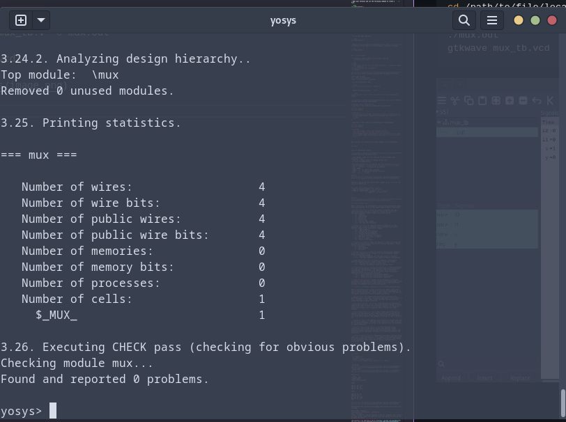

# VSD_ASIC_DESIGN

This Repository Guides you the process of complete ASIC flow, we begin our journey with simulating basic C code and go all the way to putting together an SoC ready to be fabbed out.  
*(FACULTY : Mahesh Awati, GUIDE : Kunal Ghosh)*

> The course files are present under those respective Lab directories, make sure to download all the dependencies before proceeding with the lab 

# Introduction
### Flow : 
```
  +------+     +------+     +---------+     +----+     +------+
  |  HLL | --> |  ALP | --> |  Binary | --> | HDL | --> | GDS  |
  +------+     +------+     +---------+     +----+     +------+

```
#### 1. ```HLL``` -> High level language (c , c++) 
- A high-level programming language is a type of programming language that is designed to be more human-readable and user-friendly compared to low-level languages like assembly or machine code.

#### 2. ```ALP``` -> Assembly level program
- Assembly language is a low-level programming language that is closely related to the architecture of a specific computer's central processing unit (CPU). Assembly language programs are written using mnemonic codes that represent specific machine instructions which the machine can understand.

#### 3. ```HDL``` -> Hardware Description Language
- It is a specialized programming language used for designing and describing digital hardware circuits. HDLs allow engineers to model and simulate complex digital systems before physical implementation, aiding in the design and verification of integrated circuits and FPGA configurations.
- Verilog, System Verilog, VHDL

#### 4. ```GDS``` -> Graphic Data System (layout)
- Format used in the semiconductor industry to represent the layout and design of integrated circuits at a highly detailed level. GDSII files contain information about the geometric shapes, layers, masks, and other essential details that make up the physical layout of a chip.
- Tools : Klayout, Magic

##### The Hardware needs to understand what the Application software is saying it to do.This relation can be eshtablished by System Software

____System Software____
- OS : Operating System : Handles IO, memory allocation, Low level system function
- Compiler : Convert the input to hardware dependent instruction
- Assembler : Convert the instructions provided by compiler to Binary format
- HDL : A program that understands the Binary pattern and map it to a netlist
- GDS : Layout

---

# COURSE 
 ## LAB 1
 [LAB 1: Introduction to RISCV ISA and GNU Compiler Toolchain](https://github.com/JoyenBenitto/VSD_ASIC_Design/tree/main/lab1#readme)<br>
 ### Dependencies

- Follow the instruction in the ``` README ``` to install the relevant tools:
	- [RISC-V GNU Compiler Toolchain](https://github.com/riscv-collab/riscv-gnu-toolchain)
	- [RISC-V Proxy Kernel](https://github.com/riscv-software-src/riscv-pk)
	- [RISC-V  Spike](https://github.com/riscv-software-src/riscv-isa-sim)

### C Code

- Open your terminal and run the following command to create a  ```.c```  file. 

```bash 
vim lab1/sum1ton.c 
``` 

*we are writing a C program that finds the sum of number from 1 to n*  . We are going to use SPIKE simulator to simulate the code.

```c
#include<stdio.h>

int main(){
	int sum =0, n=5;

	for(int i= 0; i <= n; ++i){
		sum += i;
	}

	printf("Sum of the series is %d", sum);
	return 0;
}
```

- To run the above code use :

```shell 
gcc lab1/sum1ton.c
```

> However this will return an executable for the system  it is run on. I am running it on an intel-i5 so the assembly is not RISC-V Assembly

```bash
cat lab1/sum1ton.c
```


### C to Disassembly 

- To generate a RISC-V object file we need to use the  ```riscv64-unknown-elf-gcc```

```bash
cd lab1
riscv64-unknown-elf-gcc -o1 -mabi=lp64 -march=rv64i -o sum1ton.o sum1ton.c
ls -ltr sum1ton.o
riscv64-unknown-elf-gcc -S sum1ton.c
vim sum1ton.c
```


>*Few flags we used*
>o1 - Level 1 optimization
>lp64 - l (long integer) p(pointer) 

- To view the assembly code:

```shell
riscv64-unknown-elf-objdump -d  sum1ton.o 
```

- Repeat the above but with ``` ofast ``` :

``` shell
riscv64-unknown-elf-gcc -ofast -mabi=lp64 -march=rv64i -o sum1ton.o sum1ton.c
```


## Integer number representation
- The below is the C code for finding max unsigned number
```c
#include <stdio.h>
#include <math.h>

int main(){
	unsigned long long int max = (unsigned long long int)(pow(2,10)*-1);
	printf("highest number represented by unsigned long long int is %llu \n",max);
	return 0;
}
```
- The below is the C code for finding range of signed numbers
```c
#include <stdio.h>
#include <math.h>

int main(){
	long long int max = (long long int)(pow(2,63)-1);
	long long int min = (long long int)(pow(2,63)*(-1));
	printf("highest number represented by long long int is %lld \n",max);
	printf("lowest number represented by long long int is %lld \n",min);
	return 0;
}
```
```
One could get the outputs for the above program as discussed above.
```

### Debug

```
spike -d $(which pk) sum1ton.c
```


- press ENTER : shows the first line and successive ENTER shows successive lines
- reg 0 a2 : checks content of register a2 0th core
- q : quit the debug process

**Difference between the ALP commands when used different optimizers**
- use the command ```riscv64-unknown-elf-objdump -d 1_to_N.o | less```
- use ``` /instance``` to search for an instance 
- press ENTER
- press ```n``` to search next occurance
- press ```N``` to search for previous occurance. 
- use ```esc :q``` to quit

#### o1:


```
The Ofast flag can be used the the above command can be run to vew the logs in a similar way !
```

## Integer number Representation (n-bit)
- Range of Unsigned numbers : [0, (2^n)-1 ]
* Range of signed numbes : Positive : [0 , 2^(n-1)-1]
                         Negative : [-1 to 2^(n-1)]

---

## Lab 2
[LAB 2: Introduction to ABI and Basic Verification Flow](https://github.com/JoyenBenitto/VSD_ASIC_Design/tree/main/lab2#readme)

### RISC-V Instructions:

RISC-V instructions can be categorized into different categories based on their functionality. Here are some common types of RISC-V instructions:

- **R-Type Instructions:** These are used for arithmetic and logic operations between two source registers, storing the result in a destination register. Common R-type instructions include:
  - `add`: Addition
  - `sub`: Subtraction
  - `and`: Bitwise AND
  - `or`: Bitwise OR
  - `xor`: Bitwise XOR
  - `slt`: Set Less Than (signed)
  - `sltu`: Set Less Than (unsigned)

- **I-Type Instructions:** These are used for arithmetic and logic operations that involve an immediate value (constant) and a source register. Common I-type instructions include:
  - `addi`: Add Immediate
  - `andi`: Bitwise AND with Immediate
  - `ori`: Bitwise OR with Immediate
  - `xori`: Bitwise XOR with Immediate
  - `lw`: Load Word (load data from memory)
  - `sw`: Store Word (store data to memory)
  - `beq`: Branch if Equal
  - `bne`: Branch if Not Equal

- **S-Type Instructions:** These are similar to I-type instructions but are used for storing values from a source register into memory. Common S-type instructions include:
  - `sb`: Store Byte
  - `sh`: Store Halfword
  - `sw`: Store Word

- **U-Type Instructions:** These are used for setting large immediate values into registers or for jumping to an absolute address. Common U-type instructions include:
  - `lui`: Load Upper Immediate (set the upper bits of a register)
  - `auipc`: Add Upper Immediate to PC (used for address calculations)

- J-Type Instructions: These are used for jumping or branching to different program locations. Common J-type instructions include:
  - `jal`: Jump and Link (used for function calls)
  - `jalr`: Jump and Link Register (used for function calls)

- **F-Type and D-Type Instructions (Floating-Point):** These instructions are used for floating-point arithmetic and include various operations like addition, multiplication, and comparison. These instructions typically have an 'F' or 'D' prefix to indicate single-precision or double-precision floating-point operations.
  - `fadd.s`: Single-precision floating-point addition
  - `fmul.d`: Double-precision floating-point multiplication
  - `fcmp.s`: Single-precision floating-point comparison

- **RV64 and RV32 Variants:** RISC-V can be configured in different bit-widths, with RV64 being a 64-bit architecture and RV32 being a 32-bit architecture. Instructions for these variants have slightly different encoding to accommodate the different data widths.


RISC-V instructions have a common structure with several fields that serve different purposes. The specific fields may vary depending on the type of instruction (R-type, I-type, S-type, U-type, etc.), but here are the typical fields you'll find in a RISC-V instruction:

- **Opcode (OP):** The opcode field specifies the operation to be performed by the instruction. It indicates what type of instruction it is (e.g., arithmetic, load, store, branch) and what specific operation within that type is being carried out.

- **Destination Register (rd):** This field specifies the destination register where the result of the instruction should be stored. In R-type instructions, this is often the first source register. In I-type and S-type instructions, this is sometimes used to specify the target register.

- **Source Register(s) (rs1, rs2):** These fields specify the source registers for the operation. For R-type instructions, rs1 and rs2 are typically the two source registers. In I-type and S-type instructions, rs1 is the source register, and immediate values may be used in place of rs2.

- **Immediate (imm):** The immediate field contains a constant value that is used as an operand in I-type and S-type instructions. This value can be an immediate constant, an offset, or an immediate value for arithmetic or logical operations.

- **Function Code (funct3, funct7):** In R-type and some I-type instructions, these fields further specify the operation. funct3 typically selects a particular function within an opcode category, and funct7 may provide additional information or further differentiate the instruction.

- **Extension-specific Fields:** Depending on the RISC-V extension being used (e.g., F for floating-point, M for integer multiplication/division), there may be additional fields to accommodate the specific requirements of that extension. These fields are not part of the base RISC-V instruction format.

### C Program - Sum of numbers from 1 to 9

```c
#include <stdio.h>

extern int load(int x, int y);

int main()
{
  int result = 0;
  int count = 9;
  result = load(0x0, count+1);
  printf("Sum of numbers from 1 to 9 is %d\n", result);
}
```
- Using gcc

- Using spike:


### Assembly
```asm
.section .text
.global load
.type load, @function

load:

add a4, a0, zero
add a2, a0, a1
add a3, a0, zero

loop:

add a4, a3, a4
addi a3, a3, 1
blt a3, a2, loop
add a0, a4, zero
ret
```


CPU processes the contents of the memory and provides with output using iverilog

Risc-V CPU : Picorv32.v
Testbench for verification : testbench.v
Tool : iverilog
script : rv32im.sh : has the commands to get the c-program, ALP, converts into hex format, loads into memory of riscv cpu, passes it iverilog and provides the output


### Register Naming in RISC-V according to ABI


# RTL Design using Verilog with SKY130 Technology

# Day 1
### Introduction to verilog RTL Design and Synthesis

Tools Required:
- gtkwave
- yosys
- iverilog
  
> In fedora all of the above can be installed using sudo dnf 

## Terminologies

  - Simulator : The RTL should be check if it matches with the specifications provided. This work is done by Simulator and is used to simulate the design for its functionality
  Example : iverilog
  Simulator looks for a change in input, based on which the output is evaluated ==> if there is no change in input, Then output is not evaluated.

  - Design : The set of verilog code(s) that represents the provided functionality/Specification in the form of a netlist.

  - Testbench : Setup to apply stimulus(test vectors)to the design inorder to check the functionality using the response obtained.
    The response is obtained using iverilog in the form of VCD file that is visulaised using gtkwave

  - Synthesizer : Tool required t convert RTL to netlist
    Example : yosys

  - Netlist : In Synthesis, RTL Design is converted to gate level netlist ie.,design is converted into gates and connections are made between the gates. This is givenout as a file called netlist.

  - liberty(.lib) : It contains all cells required to represent any logic and the cells are of different flavours(different power, delay, operating conditions etc)

## Simulation and Results:

- wirting a simple mux
- wriite a testbench 
- and check functionality

```shell
     

cd /path/to/file/location
iverilog mux.v mux_tb.v -o mux.out
./mux.out
gtkwave mux_tb.vcd
```





```verilog
/* Generated by Yosys 0.32+1 (git sha1 389b8d0f94a, gcc 13.2.1 -O2 -fexceptions -fstack-protector-strong -m64 -mtune=generic -fasynchronous-unwind-tables -fstack-clash-protection -fcf-protection -fno-omit-frame-pointer -mno-omit-leaf-frame-pointer -fPIC -Os) */

module mux(i0, i1, s, y);
  input i0;
  wire i0;
  input i1;
  wire i1;
  input s;
  wire s;
  output y;
  wire y;
  assign y = s ? i1 : i0;
endmodule

```
The above is the generated mapped file.